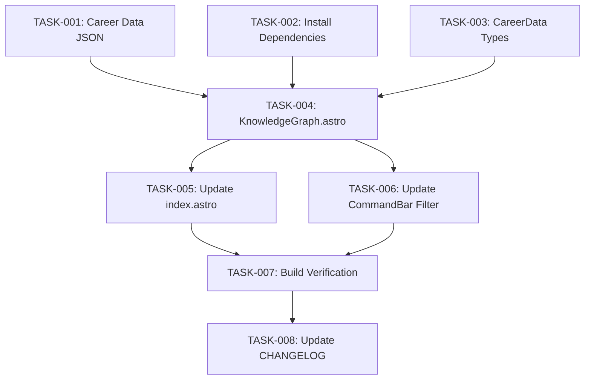

# Technical Design: career-knowledge-graph

## Metadata
- **Feature**: career-knowledge-graph
- **Status**: APPROVED
- **Created**: 2026-03-05
- **Author**: Factory Design Mode

---

## 1. Overview

### 1.1 Summary
Replace the flat Skills grid with an interactive WebGL knowledge graph using Sigma.js + graphology. Career data (roles, companies, skills, projects, education) is curated into a static `career-data.json` loaded at build time. The graph renders client-side with animated entrance, supports click-to-drill, hover tooltips, drag-to-reposition, zoom/pan, and integrates with the existing command bar filter system and theme engine. A static skills grid remains as the fallback before JS loads.

### 1.2 Goals
- Visually tell 20+ years of interconnected career experience
- Show relationships between skills, roles, projects, and companies
- Maintain full interactivity: drag, zoom, pan, click drill-down
- Integrate seamlessly with existing theme engine and command bar
- Progressive enhancement: static fallback until JS loads

### 1.3 Non-Goals
- Real-time data updates
- Resume PDF parsing automation
- 3D graph rendering
- Timeline/chronological view
- Graph export/share functionality

---

## 2. Architecture

### 2.1 High-Level Design

```
┌──────────────────────────────────────────────────────────┐
│  Build Time (Astro SSR)                                   │
│                                                           │
│  content/career-data.json ──► KnowledgeGraph.astro        │
│  content/site.json ─────────► (fallback skills grid)      │
│                                                           │
│  Output: Static HTML with fallback grid + hidden canvas   │
└──────────────────────────────────────────────────────────┘
                        │
                        ▼
┌──────────────────────────────────────────────────────────┐
│  Client-Side (Browser)                                    │
│                                                           │
│  ┌─────────────┐     ┌──────────────┐                    │
│  │ graphology   │────►│  Sigma.js    │──► WebGL Canvas   │
│  │ (graph data) │     │ (renderer)   │                    │
│  └──────┬──────┘     └──────┬───────┘                    │
│         │                    │                            │
│         ▼                    ▼                            │
│  ┌─────────────┐     ┌──────────────┐                    │
│  │ ForceAtlas2  │     │  Interactions│                    │
│  │ (layout)     │     │  (click/drag │                    │
│  └─────────────┘     │   zoom/pan)  │                    │
│                      └──────────────┘                    │
│                             │                            │
│         ┌───────────────────┼────────────────┐           │
│         ▼                   ▼                ▼           │
│  ┌─────────────┐  ┌──────────────┐  ┌─────────────┐     │
│  │ Theme API   │  │ CommandBar   │  │  Tooltip/    │     │
│  │ (colors)    │  │ (filter)     │  │  Controls    │     │
│  └─────────────┘  └──────────────┘  └─────────────┘     │
└──────────────────────────────────────────────────────────┘
```

### 2.2 Component Breakdown

| Component | Responsibility | Files |
|-----------|---------------|-------|
| CareerData | JSON data model with nodes and edges | `content/career-data.json` |
| CareerData Types | TypeScript interfaces for graph data | `src/data/site.ts` (additions) |
| KnowledgeGraph | Single-file Astro component with HTML/CSS/JS | `src/components/KnowledgeGraph.astro` |
| Page Integration | Wire component into index page | `src/pages/index.astro` |
| CommandBar Filter | Extend filter to support graph nodes | `src/components/CommandBar.astro` |

### 2.3 Data Flow

1. **Build time**: Astro frontmatter imports `career-data.json` and `site.json` skills
2. **HTML render**: Static skills grid rendered as fallback; canvas container hidden
3. **Client load**: `<script>` imports sigma + graphology, builds graph from inline JSON data
4. **Layout**: ForceAtlas2 computes positions (seeded for determinism), then freezes
5. **Animation**: Nodes animate from random positions to computed positions (1.5s staggered)
6. **Interaction**: Click/hover/drag handled by Sigma event system
7. **Theme change**: Listener on `data-theme` attribute mutation re-applies colors
8. **Filter**: CommandBar dispatches filter; graph listens and dims/highlights nodes

---

## 3. Detailed Design

### 3.1 Data Model

```typescript
// Added to src/data/site.ts
interface CareerNode {
  id: string;
  type: 'role' | 'company' | 'skill' | 'project' | 'education' | 'certification';
  label: string;
  category?: string;
  startDate?: string;
  endDate?: string;
  proficiency?: number;  // 1-5 for skills
  description?: string;
  url?: string;
}

interface CareerEdge {
  source: string;
  target: string;
  type: 'worked-at' | 'used-skill' | 'built-with' | 'earned-at' | 'requires' | 'part-of';
}

interface CareerData {
  nodes: CareerNode[];
  edges: CareerEdge[];
}
```

### 3.2 Graph Construction (Client-side)

```typescript
// Pseudocode for graph building in <script>
import Graph from 'graphology';
import Sigma from 'sigma';
import forceAtlas2 from 'graphology-layout-forceatlas2';

const graph = new Graph();

// Add nodes from career-data.json (embedded as data attribute or inline JSON)
careerData.nodes.forEach(node => {
  graph.addNode(node.id, {
    label: node.label,
    size: getSizeForType(node.type, node.proficiency),
    color: getColorForType(node.type),  // from CSS custom properties
    type: node.type,
    // random initial position for animation
    x: Math.random() * 100,
    y: Math.random() * 100,
  });
});

// Add edges
careerData.edges.forEach(edge => {
  graph.addEdge(edge.source, edge.target, {
    type: edge.type,
    color: getEdgeColor(),
    size: 1,
  });
});

// Compute layout
const positions = forceAtlas2(graph, {
  iterations: 100,
  settings: { gravity: 1, scalingRatio: 10 }
});
// Apply positions with animation
```

### 3.3 Node Sizing

| Type | Base Size | Scaling |
|------|-----------|---------|
| role | 12 | Fixed |
| company | 10 | Fixed |
| skill | 4-8 | Scaled by proficiency (1-5) |
| project | 8 | Fixed |
| education | 8 | Fixed |

### 3.4 Color Mapping (from theme CSS variables)

| Node Type | CSS Variable | Fallback |
|-----------|-------------|----------|
| role | --palette-4 | warm/orange |
| company | --palette-6 | blue |
| skill | --accent | green |
| project | --palette-2 | green variant |
| education | --palette-3 | yellow |

Colors read at runtime via `getComputedStyle(document.documentElement).getPropertyValue('--palette-N')`.

### 3.5 Interaction Design

**Click node**: Highlight node + connected neighbors. Dim all others to 0.15 opacity. Connected edges go to full opacity.

**Click background**: Reset all nodes/edges to default state.

**Hover**: Show tooltip div positioned near cursor with: label, type badge, description, date range.

**Drag**: Sigma's built-in drag behavior. Node stays at dropped position.

**Zoom/Pan**: Mouse wheel zoom, click-drag background to pan. Touch: pinch-to-zoom, drag-to-pan.

### 3.6 Animated Entrance

1. All nodes start at random positions
2. Stagger by type: companies (0ms), roles (200ms), education (400ms), skills (600ms), projects (800ms)
3. Animate x/y to ForceAtlas2 positions over 800ms with easeOutCubic
4. Total duration ~1.5s
5. `prefers-reduced-motion`: skip animation, place nodes at final positions instantly

### 3.7 Theme Integration

Listen for theme changes via MutationObserver on `document.documentElement` attribute `data-theme`. On change:
1. Re-read all `--palette-N` and semantic CSS variables
2. Update all node colors in graphology
3. Update edge colors
4. Sigma re-renders automatically when graph attributes change

### 3.8 CommandBar Filter Integration

The existing filter in CommandBar.astro queries `.skills__item` and `.card` elements. For graph integration:

1. KnowledgeGraph component exposes a global function `window.__graphFilter(keyword)`
2. CommandBar's filter function calls `window.__graphFilter(keyword)` if it exists
3. Graph filter highlights matching nodes (by label/category/type) and dims non-matching
4. `filter clear` calls `window.__graphFilter('')` to reset

This approach keeps CommandBar modifications minimal — just one additional function call.

### 3.9 Fallback Strategy

```html
<!-- Rendered at build time -->
<div class="graph__fallback">
  <!-- Existing skills grid markup -->
</div>

<!-- Hidden until JS loads -->
<div class="graph__container" style="display:none">
  <canvas class="graph__canvas"></canvas>
  ...
</div>

<script>
  // On load: hide fallback, show container
  document.querySelector('.graph__fallback').style.display = 'none';
  document.querySelector('.graph__container').style.display = '';
  // Initialize sigma...
</script>
```

---

## 4. Key Decisions

### 4.1 Single-file Component vs Multi-file

**Context**: The component will be large (estimated 800-1000 lines).

**Options**:
1. Single `.astro` file with all HTML/CSS/JS
2. Separate files (component + script + styles)

**Decision**: Single-file `.astro` component

**Rationale**: Consistent with existing patterns (CommandBar.astro 617 lines, ProjectShowcase.astro 993 lines). Astro processes `<script>` tags for bundling, so imports work naturally.

### 4.2 Graph Data Embedding

**Context**: Career data needs to reach client-side JS.

**Options**:
1. Fetch JSON at runtime
2. Embed as `data-*` attribute on container
3. Embed as inline `<script>` JSON

**Decision**: Embed as `data-career-data` attribute on the container element, JSON-stringified.

**Rationale**: No extra HTTP request, works with Astro's build-time data loading, parsed once on init. Data attribute is clean and scoped to the component.

### 4.3 ForceAtlas2 Execution

**Context**: Layout algorithm can run as continuous simulation or batch computation.

**Options**:
1. Run continuous simulation (nodes bounce around)
2. Batch compute, then freeze (deterministic)

**Decision**: Batch compute with `forceAtlas2.assign(graph, { iterations: 100 })`, then freeze.

**Rationale**: Deterministic layout, no ongoing CPU cost, nodes stay put. Seed parameter ensures same layout across loads.

### 4.4 Filter Integration Approach

**Context**: CommandBar needs to filter graph nodes alongside skills and cards.

**Options**:
1. CommandBar directly queries graph DOM/canvas (impossible — WebGL)
2. KnowledgeGraph registers filter callback that CommandBar calls
3. Custom event system

**Decision**: Global `window.__graphFilter(keyword)` function, called by CommandBar.

**Rationale**: Minimal coupling. CommandBar just checks if the function exists and calls it. Same pattern as `window.__theme` and `window.__terminal`.

---

## 5. Implementation Plan

### 5.1 Phase Summary

| Phase | Tasks | Parallel | Est. Time |
|-------|-------|----------|-----------|
| Foundation (L1) | 3 | Yes | 20 min |
| Core (L2) | 1 | No | 60 min |
| Integration (L3) | 2 | Yes | 15 min |
| Verification (L4) | 1 | No | 10 min |
| Quality (L5) | 1 | No | 10 min |
| **Total** | **8** | | **~115 min** |

### 5.2 File Ownership

| File | Task ID | Operation |
|------|---------|-----------|
| `content/career-data.json` | TASK-001 | create |
| `package.json` | TASK-002 | modify |
| `src/data/site.ts` | TASK-003 | modify |
| `src/components/KnowledgeGraph.astro` | TASK-004 | create |
| `src/pages/index.astro` | TASK-005 | modify |
| `src/components/CommandBar.astro` | TASK-006 | modify |
| `CHANGELOG.md` | TASK-008 | modify |

### 5.3 Dependency Graph



---

## 6. Risk Assessment

| Risk | Probability | Impact | Mitigation |
|------|-------------|--------|------------|
| Sigma.js bundle size (~70KB gzip) | High | Medium | Lazy-load graph JS; keep fallback grid for fast FCP |
| WebGL not available | Low | High | Fallback skills grid stays visible; `display:none` only removed by JS |
| 75+ nodes visually dense | Medium | Medium | ForceAtlas2 clustering, zoom controls, category grouping |
| ForceAtlas2 non-deterministic | Medium | Low | Use fixed seed, batch computation |
| Component file size >1000 lines | High | Low | Acceptable per project patterns (ProjectShowcase is 993) |

---

## 7. Testing Strategy

### 7.1 Build Verification
- `npx astro build` completes without errors
- No TypeScript errors in component

### 7.2 Manual Verification Checklist
- Graph renders with all node types visible
- Click node highlights connected nodes
- Click background resets
- Hover shows tooltip
- Drag repositions node
- Zoom/pan works (mouse + touch)
- Theme change updates graph colors
- `filter` command highlights matching graph nodes
- Fallback grid visible before JS loads
- `prefers-reduced-motion` skips animation
- No instances of the word "blog"

### 7.3 Verification Commands
- `npx astro build` — build passes
- `grep -r "blog" src/ content/` — no matches
- `grep -c "KnowledgeGraph" src/pages/index.astro` — returns 1+

---

## 8. Parallel Execution Notes

### 8.1 Safe Parallelization
- Level 1: TASK-001, TASK-002, TASK-003 — fully parallel (different files)
- Level 2: TASK-004 — single task, sequential
- Level 3: TASK-005, TASK-006 — parallel (different files)
- Level 4-5: Sequential

### 8.2 Recommended Workers
- Minimum: 1 worker (sequential, ~115 min)
- Optimal: 3 workers (parallel at L1 and L3)
- Maximum: 3 workers (diminishing returns beyond)

### 8.3 Estimated Duration
- Single worker: ~115 minutes
- With 3 workers: ~95 minutes
- Speedup: ~1.2x (bottleneck is TASK-004, the main component)

---

## 9. Approval

| Role | Name | Date | Signature |
|------|------|------|-----------|
| Architecture | | | PENDING |
| Engineering | | | PENDING |
