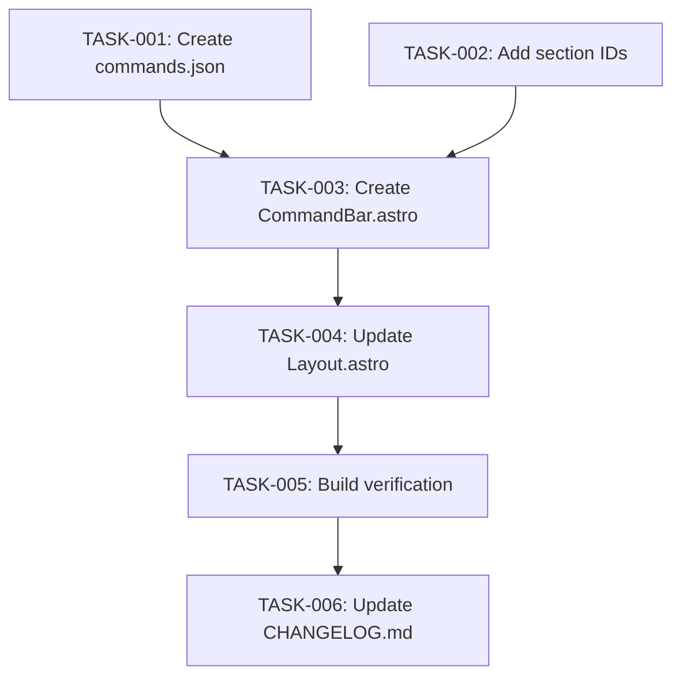

# Technical Design: Hybrid Command Bar

## Metadata
- **Feature**: hybrid-command-bar
- **Status**: APPROVED
- **Created**: 2026-03-05
- **Author**: Factory Design Mode

---

## 1. Overview

### 1.1 Summary
Add an interactive command bar overlay to the portfolio site that acts as a living terminal. Visitors press `/` or `Ctrl+K` to open a command prompt where they can switch themes, navigate sections, filter content, and discover 75 easter egg commands with rotating geeky humor. The implementation is a single Astro component (`CommandBar.astro`) with build-time data injection from `content/commands.json`, zero external JS dependencies, and full theme-engine integration via `window.__theme`.

### 1.2 Goals
- Ship 75 easter egg commands with 5-10 response variants each, rotating every 3 minutes
- Provide core navigation/utility commands: `theme`, `goto`, `filter`, `help`, `whoami`, `clear`, `history`
- Expose `window.__terminal` API for future feature integration (#3, #4)
- Maintain theme-awareness using semantic CSS variables throughout
- Progressive enhancement: base site works without JS; command bar is an enhancement

### 1.3 Non-Goals
- Knowledge graph integration (issue #3 — will consume `filter` command later)
- Project showcase integration (issue #4 — will consume `goto projects` later)
- Sound effects, command aliasing, persistent history across sessions
- Server-side processing

---

## 2. Architecture

### 2.1 High-Level Design

```
┌──────────────────────────────────────────────────────────────┐
│  Build Time (Astro)                                          │
│  ┌────────────────────────────────────────────────────────┐  │
│  │  content/commands.json                                  │  │
│  │  • 75 commands × 5-10 response variants                │  │
│  │  • Imported by CommandBar.astro <script>                │  │
│  │  • Bundled into JS chunk by Vite                        │  │
│  └────────────────────────────────────────────────────────┘  │
│  ┌────────────────────────────────────────────────────────┐  │
│  │  CommandBar.astro                                       │  │
│  │  • HTML template (overlay + input + output + mobile)    │  │
│  │  • Scoped CSS (theme-aware, reduced-motion)             │  │
│  │  • Processed <script> importing commands.json           │  │
│  └────────────────────────────────────────────────────────┘  │
│  ┌────────────────────────────────────────────────────────┐  │
│  │  Layout.astro                                           │  │
│  │  • Renders <CommandBar /> before </body>                │  │
│  └────────────────────────────────────────────────────────┘  │
└──────────────────────────────────────────────────────────────┘

┌──────────────────────────────────────────────────────────────┐
│  Client Runtime                                              │
│                                                              │
│  window.__theme  ◄────── theme command reads/writes          │
│  window.__terminal ────► public API (open/close/toggle/run)  │
│  CustomEvents ─────────► terminal:open, terminal:close,      │
│                          terminal:command                     │
│  sessionStorage ───────► command history (last 50)           │
│  localStorage ─────────► first-visit hint flag               │
│                                                              │
│  DOM targets:                                                │
│  #about, #social, #skills, #projects ◄── goto command        │
│  .skills__item, .card ◄── filter command (add/remove class)  │
└──────────────────────────────────────────────────────────────┘
```

### 2.2 Component Breakdown

| Component | Responsibility | Files |
|-----------|---------------|-------|
| Easter Egg Data | 75 command response banks, humor metadata | `content/commands.json` |
| Section Anchors | ID attributes on section elements for goto targets | `About.astro`, `SocialLinks.astro`, `Skills.astro`, `Projects.astro` |
| Command Bar | Full UI: overlay, input, output, mobile trigger, hint, all JS logic | `src/components/CommandBar.astro` |
| Layout Integration | Render CommandBar in page layout | `src/layouts/Layout.astro` |

### 2.3 Data Flow

1. **Build time**: Astro imports `commands.json` → Vite bundles it into the CommandBar JS chunk
2. **Page load**: Script initializes command registry, selects random response subset, starts 3-min rotation timer
3. **First visit**: If no `skitz0-hint-seen` in localStorage, shows hint toast for 4 seconds
4. **User presses `/`**: Command bar opens, input focuses, focus trap activates
5. **User types command + Enter**: Input parsed → registry lookup → handler executes → output appended
6. **Easter egg lookup**: Input matched against commands.json keys (exact → prefix → single-word, case-insensitive) → active response returned
7. **Theme command**: Calls `window.__theme.set(name)` / `window.__theme.list()`
8. **Goto command**: Finds section by ID → `scrollIntoView({ behavior: 'smooth' })` → closes command bar
9. **Filter command**: Queries `.skills__item` and `.card` elements → applies `.cmd-highlight` / `.cmd-dim` classes
10. **Output buffer**: Capped at 100 lines; oldest trimmed on overflow; auto-scrolls to bottom

---

## 3. Detailed Design

### 3.1 HTML Structure (CommandBar.astro)

```html
<!-- Command bar overlay — hidden by default -->
<div id="command-bar" class="cmd" role="dialog" aria-label="Command terminal" aria-modal="true" hidden>
  <div class="cmd__output" id="cmd-output" role="log" aria-live="polite"></div>
  <div class="cmd__input-row">
    <label class="cmd__prompt" for="cmd-input">
      <span class="cmd__prompt-path">visitor@skitz0.com:~</span><span class="cmd__prompt-dollar">$</span>
    </label>
    <input id="cmd-input" class="cmd__input" type="text"
           autocomplete="off" spellcheck="false" autocapitalize="off" />
  </div>
</div>

<!-- Mobile floating trigger (CSS-only visibility: hidden on desktop) -->
<button class="cmd__mobile-btn" aria-label="Open terminal" hidden>
  <span aria-hidden="true">&gt;_</span>
</button>

<!-- First-visit hint toast -->
<div id="cmd-hint" class="cmd__hint" role="status" hidden>
  Press <kbd>/</kbd> to open terminal
</div>
```

### 3.2 CSS Design

All colors use semantic CSS variables. Key styling decisions:

```css
.cmd {
  position: fixed;
  inset: 0;
  z-index: 9000; /* below grain (9999) */
  display: flex;
  flex-direction: column;
  background: var(--bg-base);
  opacity: 0.97;
  font-family: var(--font-mono);
  font-size: var(--text-sm);
}

.cmd__output {
  flex: 1;
  overflow-y: auto;
  padding: var(--space-4) var(--space-6);
}

.cmd__input-row {
  display: flex;
  align-items: center;
  padding: var(--space-3) var(--space-6);
  border-top: 1px solid var(--border);
  background: var(--bg-elevated);
}

.cmd__prompt-path { color: var(--fg-muted); }
.cmd__prompt-dollar { color: var(--accent); margin: 0 var(--space-2); }

.cmd__input {
  flex: 1;
  background: transparent;
  border: none;
  color: var(--fg-primary);
  font-family: inherit;
  font-size: inherit;
  outline: none;
  caret-color: var(--accent);
}

/* Mobile trigger — hidden on desktop via media query (AC-7) */
.cmd__mobile-btn {
  display: none;
}

@media (max-width: 768px) {
  .cmd__mobile-btn {
    display: flex;
    position: fixed;
    bottom: var(--space-6);
    right: var(--space-6);
    z-index: 8999;
    /* styled as floating action button */
  }
}

/* Output formatting classes */
.cmd-line { white-space: pre-wrap; word-break: break-word; }
.cmd-line--input { color: var(--fg-muted); }
.cmd-line--output { color: var(--fg-primary); }
.cmd-line--error { color: var(--palette-1); }
.cmd-line--accent { color: var(--accent); }

/* Filter classes applied to skills/project elements (global scope) */
:global(.cmd-highlight) {
  outline: 1px solid var(--accent);
  outline-offset: 2px;
}
:global(.cmd-dim) {
  opacity: 0.3;
}

/* Reduced motion */
@media (prefers-reduced-motion: reduce) {
  .cmd { transition: none; }
  .cmd__hint { animation: none; }
}
```

### 3.3 JavaScript Architecture

```
CommandBar JS (processed <script>)
│
├── Import commands.json (build-time bundled by Vite)
│
├── State
│   ├── isOpen: boolean
│   ├── outputLines: string[] (max 100)
│   ├── commandHistory: string[] (max 50, sessionStorage)
│   ├── historyIndex: number
│   ├── activeResponses: Record<string, string> (rotated subset)
│   └── currentFilter: string | null
│
├── Command Registry
│   ├── theme(args)   → window.__theme integration
│   ├── goto(args)    → scrollIntoView + close
│   ├── filter(args)  → DOM class manipulation
│   ├── help()        → grouped command list
│   ├── whoami()      → ASCII art bio
│   ├── clear()       → reset output buffer
│   └── history()     → show command history
│
├── Easter Egg Engine
│   ├── matchCommand(input) → exact/prefix/word matching
│   ├── rotateResponses()   → random subset selection
│   └── 3-minute rotation timer (setInterval)
│
├── UI Controller
│   ├── open()  → show overlay, focus input, trap focus
│   ├── close() → hide overlay, restore focus
│   ├── toggle()
│   ├── appendOutput(text, className)
│   ├── trimOutput() → enforce 100-line cap
│   └── autoScroll()
│
├── Input Handler
│   ├── Enter → parse + dispatch to registry or easter egg
│   ├── ArrowUp/Down → command history navigation
│   ├── Tab → tab completion
│   └── Escape → close
│
├── Keyboard Shortcuts (document-level)
│   ├── "/" → open (when not in an input/textarea)
│   ├── Ctrl+K / Cmd+K → toggle
│   └── Escape → close
│
├── Public API
│   └── window.__terminal = { open, close, toggle, run, isOpen }
│
├── Custom Events
│   ├── terminal:open
│   ├── terminal:close
│   └── terminal:command { command, output }
│
└── Init
    ├── Rotate responses (initial)
    ├── Start 3-min rotation timer
    ├── Bind keyboard shortcuts
    ├── Setup mobile button click
    ├── Check first-visit hint (localStorage)
    └── Load command history from sessionStorage
```

### 3.4 Command Matching Algorithm

```javascript
function matchCommand(input) {
  const lower = input.toLowerCase().trim();
  const commands = commandsData.commands;

  // 1. Exact match
  if (commands[lower]) return commands[lower];

  // 2. Prefix match (longest first)
  const words = lower.split(/\s+/);
  for (let len = words.length - 1; len >= 1; len--) {
    const prefix = words.slice(0, len).join(' ');
    if (commands[prefix]) return commands[prefix];
  }

  // 3. First word fallback
  if (commands[words[0]]) return commands[words[0]];

  return null;
}
```

### 3.5 Easter Egg Rotation

```javascript
const activeResponses = {};

function rotateResponses() {
  const commands = commandsData.commands;
  for (const key of Object.keys(commands)) {
    const variants = commands[key].responses;
    activeResponses[key] = variants[Math.floor(Math.random() * variants.length)];
  }
}

rotateResponses(); // Initial on load
setInterval(rotateResponses, 180000); // Every 3 minutes
```

### 3.6 commands.json Schema

```json
{
  "commands": {
    "ls": {
      "responses": [
        "drwxr-xr-x  secrets/  definitely-not-malware/  cat-pics/",
        "Permission denied. Just kidding: node_modules/ (1.2TB)",
        "total 42\n-rw-r--r-- 1 skitz0 hackers 1337 plans-for-world-domination.txt"
      ]
    },
    "sudo rm -rf /": {
      "responses": [
        "I'm sorry Dave, I'm afraid I can't do that.",
        "Nice try. This isn't a real terminal... or is it?"
      ]
    }
  },
  "meta": {
    "version": 1,
    "humor_sources": ["star-wars", "portal", "monty-python", "hitchhikers", "office-space", "it-crowd", "silicon-valley", "xkcd", "computing", "programming"]
  }
}
```

### 3.7 Filter Command Implementation

```javascript
function handleFilter(args) {
  const keyword = args.trim().toLowerCase();

  // Clear existing filter
  document.querySelectorAll('.cmd-highlight, .cmd-dim').forEach(el => {
    el.classList.remove('cmd-highlight', 'cmd-dim');
  });

  if (!keyword || keyword === 'clear' || keyword === 'reset') {
    return 'Filter cleared.';
  }

  let matchCount = 0;
  const skills = document.querySelectorAll('.skills__item');
  const cards = document.querySelectorAll('.card');

  skills.forEach(el => {
    const text = el.textContent.toLowerCase();
    if (text.includes(keyword)) {
      el.classList.add('cmd-highlight');
      matchCount++;
    } else {
      el.classList.add('cmd-dim');
    }
  });

  cards.forEach(el => {
    const text = (el.querySelector('.card__title')?.textContent + ' ' +
                  el.querySelector('.card__desc')?.textContent + ' ' +
                  (el.querySelector('.card__tags')?.textContent || '')).toLowerCase();
    if (text.includes(keyword)) {
      el.classList.add('cmd-highlight');
      matchCount++;
    } else {
      el.classList.add('cmd-dim');
    }
  });

  return `Found ${matchCount} match${matchCount !== 1 ? 'es' : ''} across skills and projects.`;
}
```

### 3.8 whoami Output

```
+---------------------------------------------------+
|  skitz0 -- Senior Linux Cloud Engineer            |
|  Core member & instructor @ HackersGuildPGH       |
|                                                   |
|  We like to take things apart                     |
|  and see how they work.                           |
|                                                   |
|  Hobbies include: breaking prod at 4am,           |
|  3D printing things nobody asked for,             |
|  and mass: "It works on my machine"               |
|                                                   |
|  PGP: Don't ask. I lost the key.                  |
+---------------------------------------------------+
```

---

## 4. Key Decisions

### 4.1 Processed Script vs Inline Script

**Context**: The command bar JS needs access to commands.json data and needs to run client-side.

**Options**:
1. `<script is:inline>` with `define:vars` — data serialized into HTML inline
2. Processed `<script>` with `import` — Vite bundles JSON into JS chunk
3. Runtime `fetch()` — load JSON dynamically

**Decision**: Processed `<script>` with static `import`.

**Rationale**: Vite optimizes the JSON import, defers loading (non-blocking), and enables tree-shaking. The command bar is progressive enhancement so deferred loading is fine. Inline scripts with `define:vars` would bloat HTML and aren't optimized.

### 4.2 Full-Screen Overlay vs Bottom Panel

**Context**: The command bar needs to display scrollable output history.

**Options**:
1. Full-screen overlay (position: fixed, inset: 0)
2. Bottom panel (slides up, partial height)
3. Bottom bar (single line, no scrollback)

**Decision**: Full-screen overlay at 97% opacity.

**Rationale**: Scrollable output history requires space. A full-screen overlay provides maximum room for ASCII art, tables, and long help output while maintaining the immersive terminal feel. The slight transparency (97%) lets the site peek through for context.

### 4.3 Section IDs vs Class-Based Querying for Goto

**Context**: The `goto` command needs to scroll to page sections.

**Options**:
1. Add `id` attributes to section elements
2. Query by existing class names (`.about`, `.skills`, etc.)
3. Query by heading IDs (`about-heading`, etc.)

**Decision**: Add `id` attributes to section elements.

**Rationale**: IDs are the standard anchor mechanism, work with URL hash navigation, and are more reliable than class names. The existing heading IDs (`about-heading`) point to the h2, not the section — scrolling to the heading misses the section padding. Adding IDs to sections is a minimal change (4 files, 1 line each).

### 4.4 Filter Styling Strategy

**Context**: Filter command needs to highlight/dim elements across different components.

**Options**:
1. Add filter classes to global.css
2. Use `:global()` in CommandBar.astro scoped styles
3. Apply inline styles via JS

**Decision**: Use `:global()` in CommandBar.astro scoped styles.

**Rationale**: Keeps all command bar styling co-located in one file. Astro's `:global()` escapes scope for specific selectors while the rest remains scoped. No inline style manipulation (AC-6 says CSS classes only). No changes to global.css needed.

---

## 5. Implementation Plan

### 5.1 Phase Summary

| Phase | Tasks | Parallel | Est. Time |
|-------|-------|----------|-----------|
| Foundation (L1) | 2 | Yes | 30 min |
| Core (L2) | 1 | No | 60 min |
| Integration (L3) | 1 | No | 10 min |
| Verification (L4) | 1 | No | 10 min |
| Quality (L5) | 1 | No | 5 min |

### 5.2 File Ownership

| File | Task ID | Operation |
|------|---------|-----------|
| `content/commands.json` | TASK-001 | create |
| `src/components/About.astro` | TASK-002 | modify |
| `src/components/SocialLinks.astro` | TASK-002 | modify |
| `src/components/Skills.astro` | TASK-002 | modify |
| `src/components/Projects.astro` | TASK-002 | modify |
| `src/components/CommandBar.astro` | TASK-003 | create |
| `src/layouts/Layout.astro` | TASK-004 | modify |
| _(build verification)_ | TASK-005 | read-only |
| `CHANGELOG.md` | TASK-006 | modify |

### 5.3 Dependency Graph



### 5.4 Consumer Matrix

| Task | Creates | Consumed By | Integration Test |
|------|---------|-------------|-----------------|
| TASK-001 | `content/commands.json` | TASK-003 | Build verification in TASK-005 |
| TASK-002 | Modified section components | TASK-003 (goto targets) | Build verification in TASK-005 |
| TASK-003 | `src/components/CommandBar.astro` | TASK-004 | Build verification in TASK-005 |
| TASK-004 | Modified `Layout.astro` | TASK-005 | Build verification in TASK-005 |
| TASK-005 | _(verification only)_ | leaf | — |
| TASK-006 | Modified `CHANGELOG.md` | leaf | — |

---

## 6. Risk Assessment

| Risk | Probability | Impact | Mitigation |
|------|-------------|--------|------------|
| Bundle size exceeds 50KB gzipped | Low | Medium | Easter egg responses kept concise (~80 chars avg); monitor with `du` after build |
| Focus trap interferes with screen readers | Low | High | Use `aria-modal="true"`, test with role="dialog", `inert` on body if needed |
| `/` key conflicts with browser find or other shortcuts | Low | Low | Only intercept when no input/textarea is focused; prevent propagation |
| `goto` scroll position off due to fixed elements | Low | Low | Use `scrollIntoView` with block: 'start' and add scroll-margin-top to sections |
| Mobile keyboard obscures command bar input | Medium | Medium | Command bar is full-screen; input at bottom; OS keyboard will push viewport |
| commands.json accidentally contains "blog" | Low | High | Grep verification in TASK-005 |

---

## 7. Testing Strategy

### 7.1 Build Verification
- `npx astro build` succeeds with no errors
- Bundle size check: JS chunk < 50KB gzipped

### 7.2 Content Verification
- `commands.json` is valid JSON with all 75 commands
- Each command has 5-10 response variants
- No response contains the word "blog" (case-insensitive grep)

### 7.3 Manual Verification Checklist
- [ ] `/` key opens command bar
- [ ] `Ctrl+K` / `Cmd+K` opens command bar
- [ ] `Escape` closes command bar
- [ ] All 7 core commands work (theme, goto, filter, help, whoami, clear, history)
- [ ] Easter egg commands return responses
- [ ] Command history works with up/down arrows
- [ ] Tab completion works for command names
- [ ] Output buffer trims at 100 lines
- [ ] Mobile floating button visible on narrow viewport
- [ ] First-visit hint shows once
- [ ] `window.__terminal` API is accessible
- [ ] Custom events fire correctly
- [ ] Focus trap works when open
- [ ] All colors use theme CSS variables
- [ ] `prefers-reduced-motion` respected

### 7.4 Verification Commands
```bash
npx astro build
grep -ri "blog" content/commands.json  # must return nothing
grep -ri "blog" src/components/CommandBar.astro  # must return nothing
```

---

## 8. Parallel Execution Notes

### 8.1 Safe Parallelization
- Level 1: TASK-001 and TASK-002 have no shared files, fully parallel
- Level 2+: Sequential (each depends on previous level)
- No two tasks modify the same file

### 8.2 Recommended Workers
- Minimum: 1 worker (sequential)
- Optimal: 2 workers (L1 parallel)
- Maximum: 2 workers (only 2 tasks at widest level)

### 8.3 Estimated Duration
- Single worker: ~115 min
- With 2 workers: ~85 min
- Speedup: ~1.35x

---

## 9. Approval

| Role | Name | Date | Signature |
|------|------|------|-----------|
| Architecture | | | PENDING |
| Engineering | | | PENDING |
