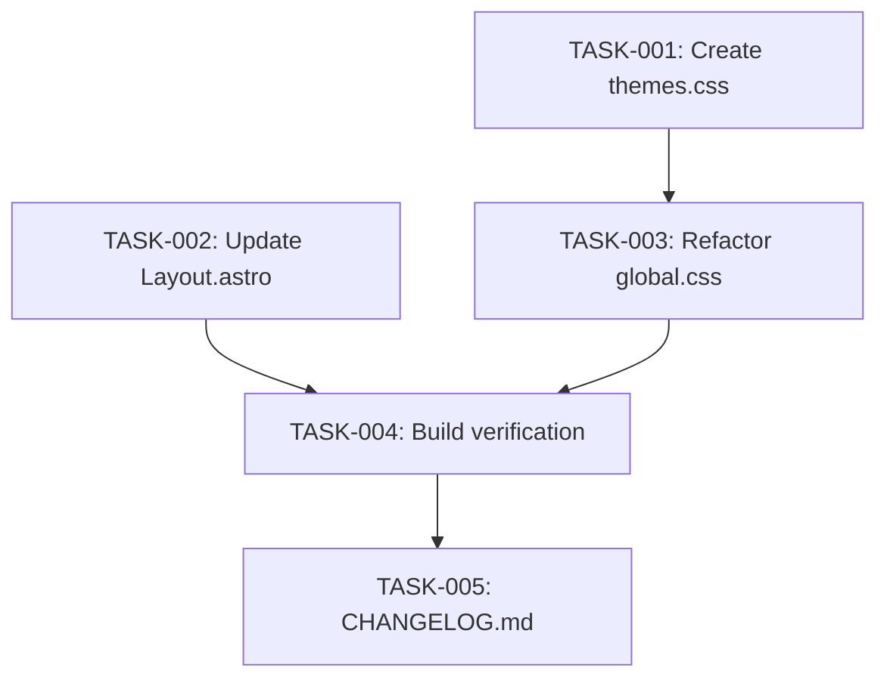

# Technical Design: Terminal Theme Engine

## Metadata
- **Feature**: terminal-theme-engine
- **Status**: APPROVED
- **Created**: 2026-03-05
- **Author**: Factory Design Mode

---

## 1. Overview

### 1.1 Summary
Replace the hardcoded dark color scheme in `global.css` with a CSS custom property-based theme engine supporting 5 Ghostty-sourced themes. Themes are applied via a `data-theme` attribute on `<html>`, persisted in localStorage, and exposed through a `window.__theme` JS API for the future command bar. An inline `<head>` script prevents FOUC by applying the theme before first paint.

### 1.2 Goals
- Ship 5 complete themes with accurate Ghostty color mappings
- Zero-FOUC theme loading with localStorage + prefers-color-scheme fallback
- Expose `window.__theme` API for command bar integration (issue #2)
- Maintain all existing component styling through semantic CSS variable compatibility
- Theme-aware grain overlay and selection styles

### 1.3 Non-Goals
- Command bar UI (issue #2)
- UI-based theme picker/toggle
- Runtime user-defined themes
- Per-component theme overrides

---

## 2. Architecture

### 2.1 High-Level Design

```
┌──────────────────────────────────────────────────────────┐
│  <head>                                                  │
│  ┌────────────────────────────────────────────────────┐  │
│  │  Inline <script> (theme-init)                      │  │
│  │  • Read localStorage('skitz0-theme')               │  │
│  │  • Fallback: prefers-color-scheme → theme name     │  │
│  │  • Set document.documentElement.dataset.theme      │  │
│  │  • Expose window.__theme { set, get, list }        │  │
│  └────────────────────────────────────────────────────┘  │
│  ┌────────────────────────────────────────────────────┐  │
│  │  global.css → @import './themes.css'               │  │
│  │  • Non-color tokens (typography, spacing, motion)  │  │
│  │  • Base styles, selection, grain, transitions      │  │
│  └────────────────────────────────────────────────────┘  │
│  ┌────────────────────────────────────────────────────┐  │
│  │  themes.css                                        │  │
│  │  • :root { Duotone Dark defaults }                 │  │
│  │  • [data-theme="flexoki-light"] { ... }            │  │
│  │  • [data-theme="homebrew"] { ... }                 │  │
│  │  • [data-theme="dracula"] { ... }                  │  │
│  │  • [data-theme="nord"] { ... }                     │  │
│  └────────────────────────────────────────────────────┘  │
└──────────────────────────────────────────────────────────┘
┌──────────────────────────────────────────────────────────┐
│  <body>                                                  │
│  Components use semantic CSS vars:                       │
│  --bg-base, --fg-primary, --accent, etc.                 │
│  (No changes needed — names already match)               │
└──────────────────────────────────────────────────────────┘
```

### 2.2 Component Breakdown

| Component | Responsibility | Files |
|-----------|---------------|-------|
| Theme Definitions | Raw palette + semantic alias CSS blocks per theme | `src/styles/themes.css` |
| Theme Init Script | FOUC prevention, localStorage, prefers-color-scheme, `window.__theme` API | Inline in `src/layouts/Layout.astro` |
| Global Styles | Import themes, base styles, grain overlay, selection, transitions | `src/styles/global.css` |
| Layout Shell | HTML structure, inline script injection, `data-theme` on `<html>` | `src/layouts/Layout.astro` |

### 2.3 Data Flow

1. **Page load** → Inline `<script>` in `<head>` runs before CSS paints
2. **Script** reads `localStorage.getItem('skitz0-theme')`
3. If null → checks `window.matchMedia('(prefers-color-scheme: light)')` → picks `flexoki-light` or `duotone-dark`
4. Sets `document.documentElement.dataset.theme = themeName`
5. **CSS** matches `[data-theme="..."]` selector → applies correct palette + semantic vars
6. **Components** read semantic vars → render with correct colors
7. **Theme switch** (via command bar calling `window.__theme.set(name)`) → updates `data-theme`, saves to localStorage, adds `.theme-transitioning` class briefly

---

## 3. Detailed Design

### 3.1 Theme CSS Structure (themes.css)

Each theme block provides:
- Raw palette: `--palette-0` through `--palette-15`
- Theme-specific: `--theme-bg`, `--theme-fg`, `--theme-cursor`, `--theme-cursor-text`, `--theme-selection-bg`, `--theme-selection-fg`
- Semantic aliases: `--bg-base`, `--bg-elevated`, `--bg-card`, `--bg-hover`, `--fg-primary`, `--fg-secondary`, `--fg-muted`, `--accent`, `--accent-dim`, `--accent-glow`, `--border`, `--border-focus`, `--selection-bg`, `--selection-fg`
- Grain control: `--grain-opacity`, `--grain-invert`

```css
/* Example structure for one theme */
:root,
[data-theme="duotone-dark"] {
  /* Raw palette */
  --palette-0: #1f1d27;
  --palette-1: #d9393e;
  /* ... through --palette-15 */

  /* Theme-specific */
  --theme-bg: #1f1d27;
  --theme-fg: #b7a1ff;
  --theme-cursor: #ff9839;
  --theme-cursor-text: #1f1d27;
  --theme-selection-bg: #353147;
  --theme-selection-fg: #b7a2ff;

  /* Semantic aliases */
  --bg-base: var(--theme-bg);
  --bg-elevated: #2a2833;    /* bg lightened ~5% */
  --bg-card: #24222e;        /* between base and elevated */
  --bg-hover: #302e3b;       /* bg lightened ~8% */
  --fg-primary: var(--theme-fg);
  --fg-secondary: var(--palette-7);
  --fg-muted: var(--palette-8);
  --accent: var(--palette-2);
  --accent-dim: /* slightly darker accent */;
  --accent-glow: /* accent at ~15% alpha */;
  --border: #353147;
  --border-focus: var(--accent);
  --selection-bg: var(--theme-selection-bg);
  --selection-fg: var(--theme-selection-fg);

  /* Grain */
  --grain-opacity: 0.04;
  --grain-invert: 0;  /* 0 = light grain for dark bg */
}

[data-theme="flexoki-light"] {
  /* ... same structure, light theme values ... */
  --grain-opacity: 0.03;
  --grain-invert: 1;  /* 1 = dark grain for light bg */
}
```

### 3.2 Derived Color Strategy

For `--bg-elevated`, `--bg-card`, `--bg-hover`, `--accent-dim`, `--accent-glow`:
- **Dark themes**: Lighten background by fixed amounts (HSL lightness +3%, +5%, +8%)
- **Light themes**: Darken background by similar amounts
- **Accent-dim**: Darken accent ~15%
- **Accent-glow**: Accent color at 15% opacity (rgba)
- All derived values are hardcoded per theme (no runtime color math needed)

### 3.3 Theme Init Script (inline in `<head>`)

```javascript
(function() {
  var THEMES = ['duotone-dark','flexoki-light','homebrew','dracula','nord'];
  var STORAGE_KEY = 'skitz0-theme';
  var DEFAULT_DARK = 'duotone-dark';
  var DEFAULT_LIGHT = 'flexoki-light';
  var root = document.documentElement;

  function get() {
    return root.dataset.theme || DEFAULT_DARK;
  }

  function set(name) {
    if (THEMES.indexOf(name) === -1) return false;
    root.dataset.theme = name;
    try { localStorage.setItem(STORAGE_KEY, name); } catch(e) {}
    return true;
  }

  function list() {
    return THEMES.slice();
  }

  // Apply on load (before paint)
  var saved = null;
  try { saved = localStorage.getItem(STORAGE_KEY); } catch(e) {}
  if (saved && THEMES.indexOf(saved) !== -1) {
    root.dataset.theme = saved;
  } else if (window.matchMedia && window.matchMedia('(prefers-color-scheme: light)').matches) {
    root.dataset.theme = DEFAULT_LIGHT;
  } else {
    root.dataset.theme = DEFAULT_DARK;
  }

  window.__theme = { set: set, get: get, list: list };
})();
```

### 3.4 Theme Transition CSS (in global.css)

```css
.theme-transitioning,
.theme-transitioning *,
.theme-transitioning *::before,
.theme-transitioning *::after {
  transition: color 80ms ease, background-color 80ms ease,
              border-color 80ms ease, box-shadow 80ms ease !important;
}

@media (prefers-reduced-motion: reduce) {
  .theme-transitioning,
  .theme-transitioning *,
  .theme-transitioning *::before,
  .theme-transitioning *::after {
    transition: none !important;
  }
}
```

The `window.__theme.set()` function adds `.theme-transitioning` to `<html>`, switches the theme, then removes the class after 100ms via `setTimeout`.

### 3.5 Grain Overlay Update (in global.css)

```css
.grain {
  position: fixed;
  inset: 0;
  pointer-events: none;
  z-index: 9999;
  opacity: var(--grain-opacity, 0.04);
  filter: invert(var(--grain-invert, 0));
  background-image: url("data:image/svg+xml,...");
}
```

### 3.6 Selection Styles Update (in global.css)

```css
::selection {
  background: var(--selection-bg);
  color: var(--selection-fg);
}
```

---

## 4. Key Decisions

### 4.1 Theme Colors in CSS vs JS/JSON

**Context**: Theme color data could live in CSS (static `[data-theme]` blocks), in JSON (loaded at runtime), or generated at build time.

**Options**:
1. Pure CSS `[data-theme]` selectors: Pros — zero runtime cost, works without JS for rendering. Cons — slight duplication.
2. JSON + JS injection: Pros — single source of truth. Cons — requires JS for rendering, adds complexity.
3. Astro build-time generation: Pros — DRY. Cons — overengineered for 5 themes.

**Decision**: Pure CSS `[data-theme]` selectors.

**Rationale**: NFR-3 requires zero JS runtime for theme rendering. CSS attribute selectors are the simplest, most performant approach. 5 themes is a small, manageable number. Adding a new theme means adding one CSS block.

### 4.2 Derived Colors: Hardcoded vs Computed

**Context**: Semantic aliases like `--bg-elevated` need to be derived from the theme background.

**Options**:
1. Hardcode all derived values per theme
2. Use CSS `color-mix()` / `oklch()` for runtime derivation
3. Use `calc()` on HSL channels

**Decision**: Hardcode all derived values per theme.

**Rationale**: `color-mix()` has good but not universal browser support. Hardcoding is simpler, more predictable, and lets us fine-tune each theme's derived colors independently. The cost is ~6 extra lines per theme, which is trivial.

### 4.3 Inline Script vs External Script for Theme Init

**Context**: The theme must be applied before first paint to prevent FOUC.

**Decision**: Inline `<script>` in `<head>` (not an external file).

**Rationale**: An external script would require a network request, introducing a race condition with CSS. Inline script executes synchronously before the parser reaches `<body>`, guaranteeing the `data-theme` attribute is set before any rendering occurs.

### 4.4 Theme CSS in Separate File vs Inline

**Context**: Theme definitions could go in global.css or a separate themes.css.

**Decision**: Separate `src/styles/themes.css` imported by `global.css`.

**Rationale**: Separation of concerns. Theme color data is distinct from base styles. NFR-6 says adding a theme should mean "adding one data block" — having all themes in one dedicated file makes this clear. The `@import` is resolved at build time by Astro/Vite, so there's no runtime cost.

---

## 5. Implementation Plan

### 5.1 Phase Summary

| Phase | Tasks | Parallel | Est. Time |
|-------|-------|----------|-----------|
| Foundation (L1) | 2 | Yes | 20 min |
| Core (L2) | 2 | Yes | 25 min |
| Integration (L3) | 1 | No | 15 min |
| Quality (L4) | 1 | No | 10 min |

### 5.2 File Ownership

| File | Task ID | Operation |
|------|---------|-----------|
| `src/styles/themes.css` | TASK-001 | create |
| `src/layouts/Layout.astro` | TASK-002 | modify |
| `src/styles/global.css` | TASK-003 | modify |
| _(build verification)_ | TASK-004 | read-only |
| `CHANGELOG.md` | TASK-005 | create |

### 5.3 Dependency Graph



---

## 6. Risk Assessment

| Risk | Probability | Impact | Mitigation |
|------|-------------|--------|------------|
| FOUC on slow connections | Low | Medium | Inline script is synchronous, runs before CSS paint |
| Derived colors look wrong per theme | Medium | Low | Each theme's derived colors are manually tuned and can be adjusted independently |
| Component uses hardcoded color we missed | Low | Medium | Grep for hex codes in components during TASK-004 |
| localStorage blocked (incognito/privacy) | Low | Low | try/catch around localStorage calls, falls back to prefers-color-scheme |

---

## 7. Testing Strategy

### 7.1 Build Verification
- `npm run build` succeeds with no errors
- `npm run dev` renders all 5 themes correctly

### 7.2 Manual Verification Checklist
- [ ] Each theme applies correct colors via `document.documentElement.dataset.theme = 'name'`
- [ ] `window.__theme.set('name')` switches theme and persists
- [ ] Page reload preserves selected theme
- [ ] Clearing localStorage and using light-mode OS → Flexoki Light loads
- [ ] Clearing localStorage and using dark-mode OS → Duotone Dark loads
- [ ] Grain overlay adjusts opacity/inversion per theme
- [ ] `::selection` uses theme selection colors
- [ ] Theme transition is smooth (~80ms), no transition on page load
- [ ] `prefers-reduced-motion` disables transition animation
- [ ] No hardcoded hex colors remain in component files

### 7.3 Verification Commands
- `npx astro check` — type checking
- `npx astro build` — production build succeeds
- `grep -rn '#[0-9a-fA-F]\{3,8\}' src/components/` — no hardcoded colors in components

---

## 8. Parallel Execution Notes

### 8.1 Safe Parallelization
- Level 1: TASK-001 and TASK-002 have no shared files, fully parallel
- Level 2: TASK-003 depends on TASK-001 (needs themes.css to import). TASK-003 does not depend on TASK-002.
- Level 3+: Sequential

### 8.2 Recommended Workers
- Minimum: 1 worker (sequential)
- Optimal: 2 workers (L1 parallel)
- Maximum: 2 workers (only 2 tasks at widest level)

### 8.3 Estimated Duration
- Single worker: ~70 min
- With 2 workers: ~50 min
- Speedup: ~1.4x

---

## 9. Consumer Matrix

| Task | Creates | Consumed By | Integration Test |
|------|---------|-------------|-----------------|
| TASK-001 | `src/styles/themes.css` | TASK-003 | Build verification in TASK-004 |
| TASK-002 | Modified `Layout.astro` | TASK-004 | Build verification in TASK-004 |
| TASK-003 | Modified `global.css` | TASK-004 | Build verification in TASK-004 |
| TASK-004 | _(verification only)_ | leaf | — |
| TASK-005 | `CHANGELOG.md` | leaf | — |

---

## 10. Approval

| Role | Name | Date | Signature |
|------|------|------|-----------|
| Architecture | | | PENDING |
| Engineering | | | PENDING |
